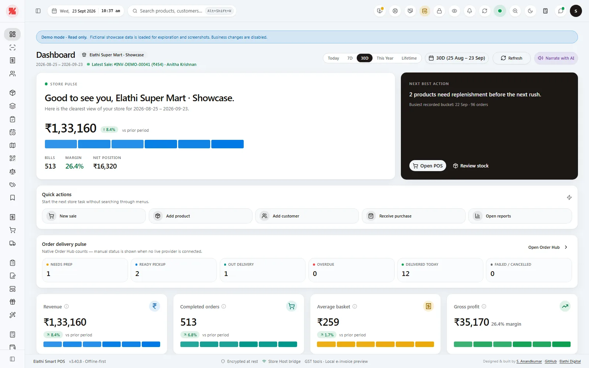
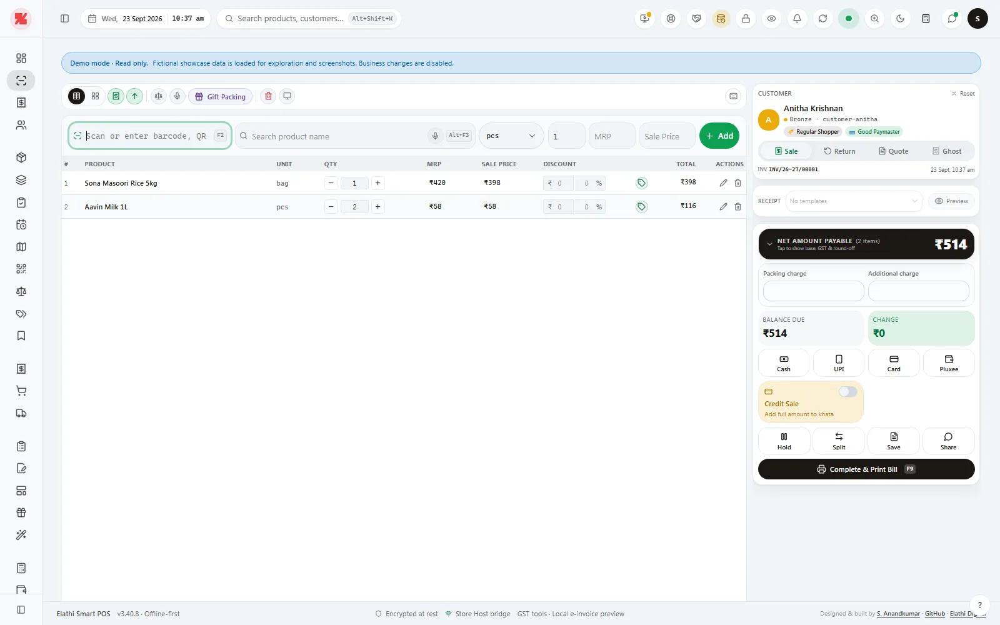
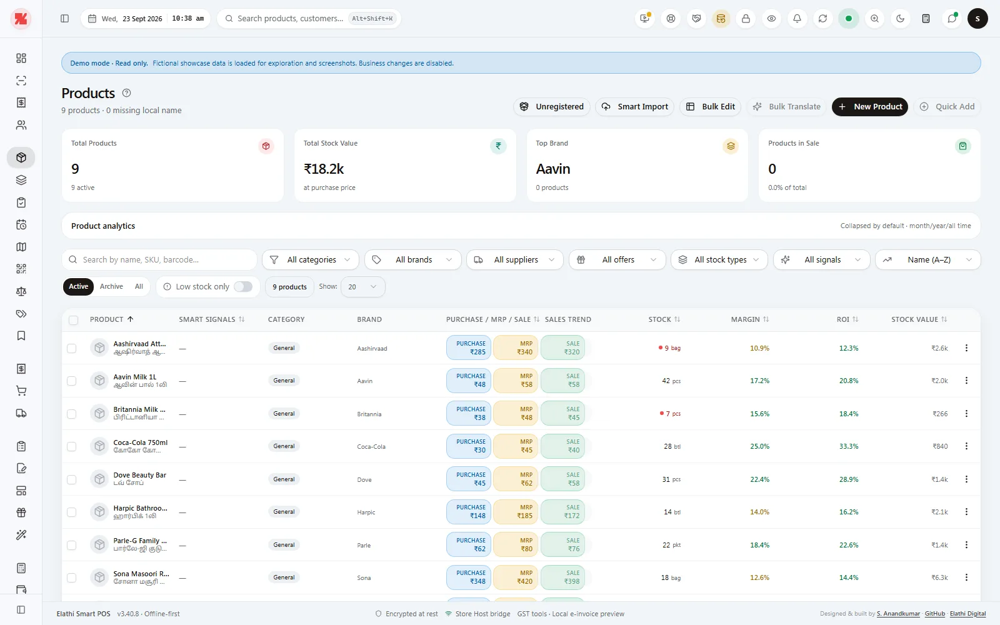
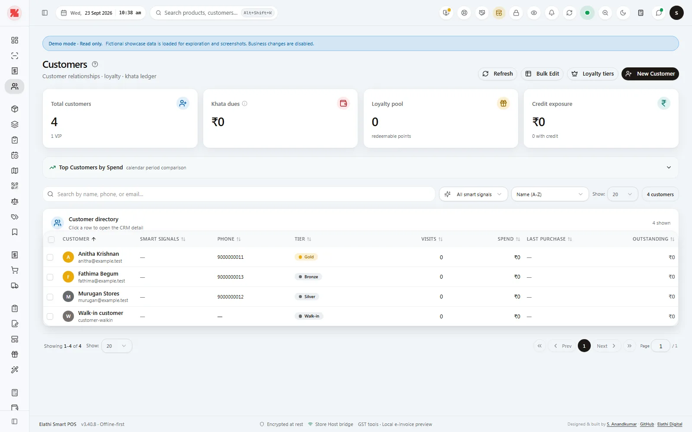
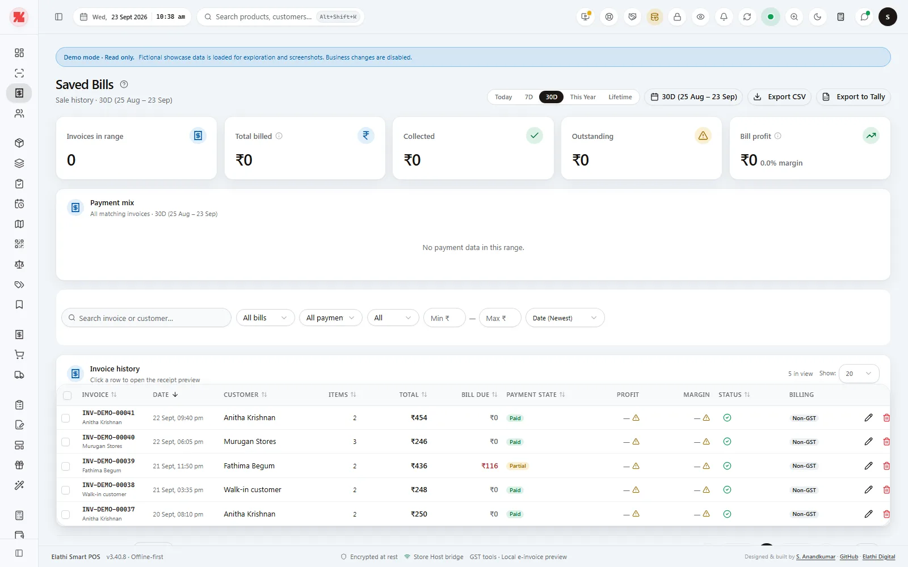
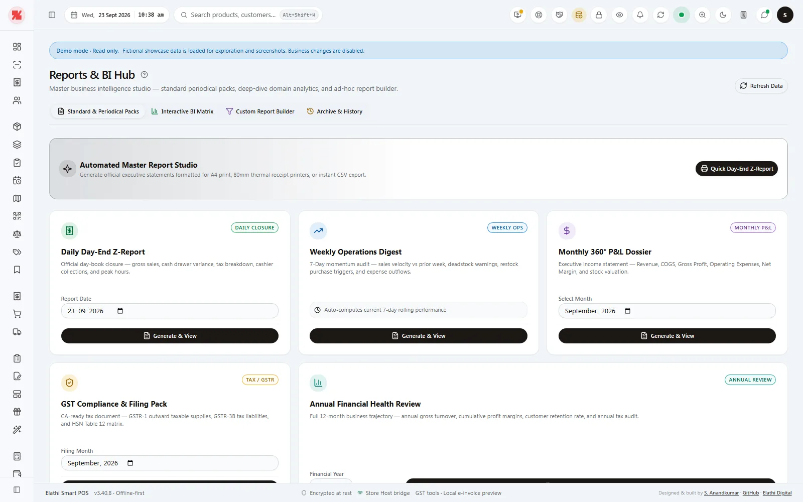
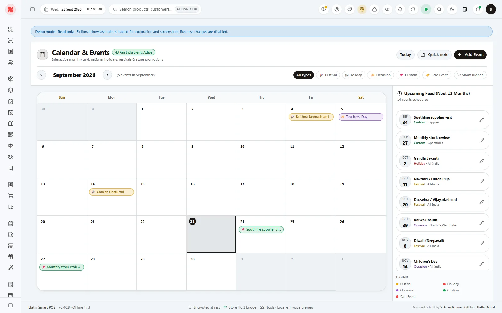

<!-- SMARTPOS_LANDING_START -->
# Elathi SmartPOS

## A calm, capable point of sale for growing stores

Elathi SmartPOS brings billing, inventory, purchasing, customer accounts, supplier tracking, reporting, and signed Windows updates into one dependable retail workspace.

**[Download the latest signed release](https://github.com/Elathi/elathi-smartpos-releases/releases/latest)** | **[View release history](https://github.com/Elathi/elathi-smartpos-releases/releases)** | **[Visit elathi.xyz](https://elathi.xyz/)**

> This repository publishes official signed Windows installers and update manifests. A latest download appears after the release owner publishes the first stable release.

## Built for daily retail work

- **Fast checkout** - barcode and product search, discounts, returns, multiple payment methods, credit sales, and receipts.
- **Stock you can trust** - products, pricing, batches, expiry tracking, stock counts, and purchase history.
- **Professional invoices** - GST-ready billing, configurable receipts, invoice previews, and print/PDF workflows.
- **Clear business follow-up** - customer balances, supplier dues, purchase bills, reports, notes, and reminders.
- **Protected upgrades** - signed releases, safe installation, backup guidance, and local store-data preservation.

## Product showcase

The gallery uses fictional, read-only showcase data. It contains no customer credentials, personal phone numbers, or production business data.

| Dashboard | POS billing |
| --- | --- |
|  |  |

| Products and inventory | Customers and suppliers |
| --- | --- |
|  |  |

| Saved bills and analytics | Reports |
| --- | --- |
|  |  |

| Calendar and reminders |
| --- |
|  |

## Download and upgrade safely

1. Open the latest release and download the signed Windows installer.
2. Close or hold active sales and take a backup before upgrading an existing store.
3. Install SmartPOS over the existing installation when Windows prompts you.
4. Use **Settings -> Updates** or the top-bar update control to check the official signed channel.

SmartPOS verifies signed updates before installation and preserves the local store database during the normal in-place upgrade path. Do not use installers or signatures from unofficial mirrors.

## Browser preview

The optional `?showcase=1` browser preview is a read-only visual demonstration using fictional records. It is intended for product review and screenshots, not business operations or data storage.

## Support and product links

- **Signed downloads and release history:** [GitHub Releases](https://github.com/Elathi/elathi-smartpos-releases/releases)
- **Stable updater manifest:** [`latest.json`](https://github.com/Elathi/elathi-smartpos-releases/releases/latest/download/latest.json)
- **Product website:** [elathi.xyz](https://elathi.xyz/)
- **Contact and support:** [elathi.xyz/contact](https://elathi.xyz/contact/)

<!-- SMARTPOS_LANDING_END -->

<!-- SMARTPOS_RELEASES_MANAGED_START -->
## Signed releases

The latest stable release is **v3.40.15** (overview refreshed 2026-09-23 UTC).

- [Download the latest signed Windows release](https://github.com/Elathi/elathi-smartpos-releases/releases/latest)
- [Stable update manifest](https://github.com/Elathi/elathi-smartpos-releases/releases/latest/download/latest.json)
- [Read the current release notes](https://github.com/Elathi/elathi-smartpos-releases/releases/tag/v3.40.15)
- Existing installations can use **Settings -> Updates** or the global update control.
- SmartPOS verifies the signed updater and preserves the local store database during in-place upgrades.

Release-specific compatibility and migration notes are maintained in the matching GitHub release body. If this repository has no published release yet, the release owner should leave this section at its pre-release state until the first signed publication completes.

<!-- SMARTPOS_RELEASES_MANAGED_END -->
